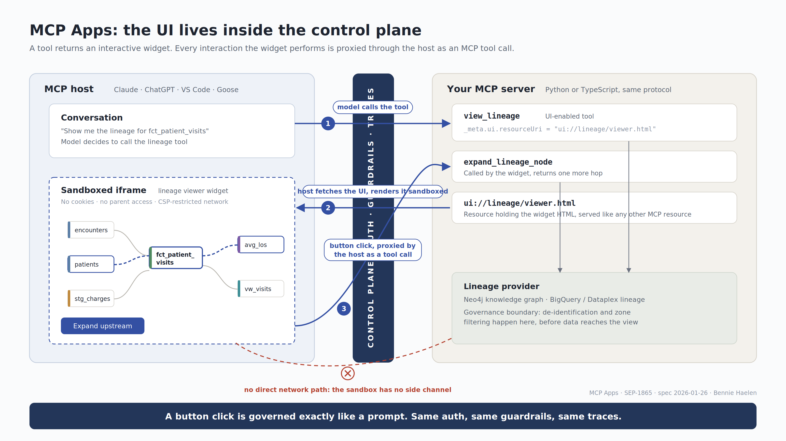
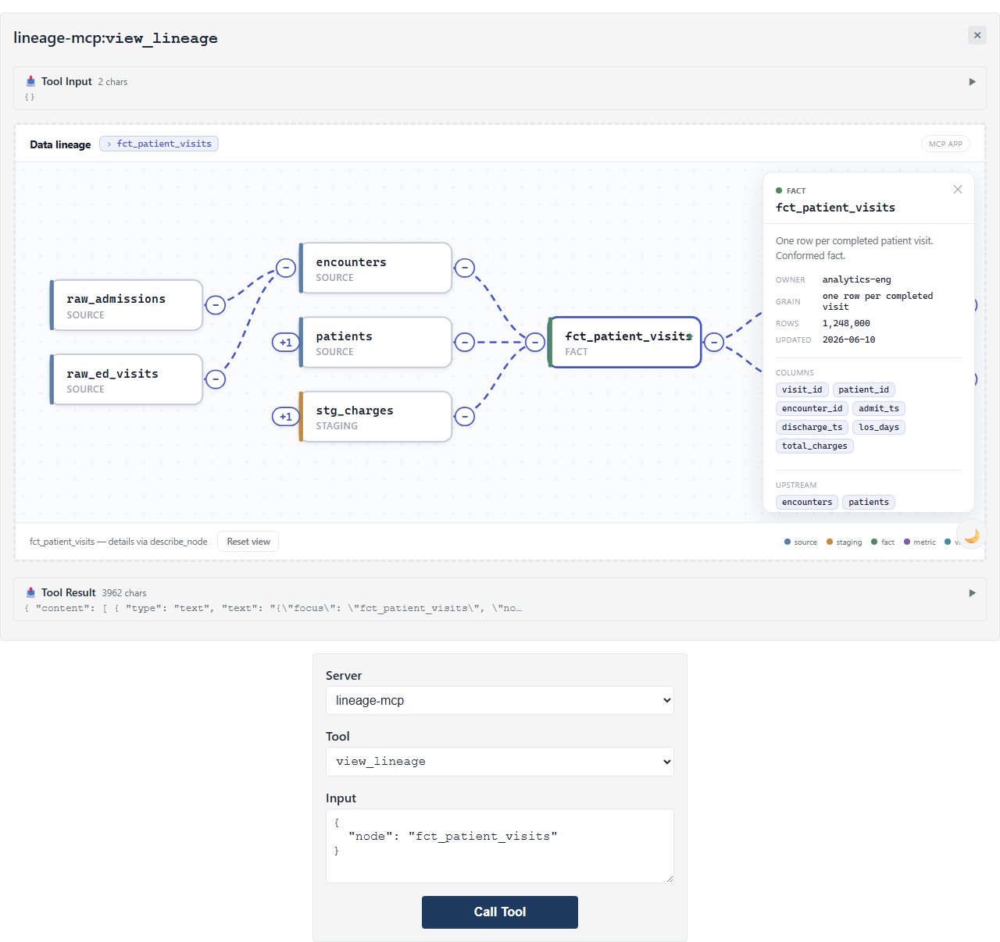
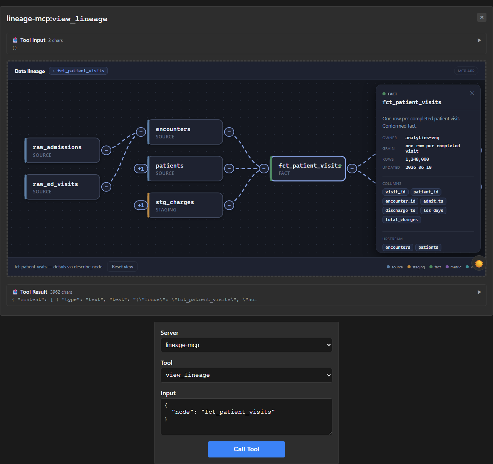

# Lineage MCP — an interactive MCP App that lives inside the control plane

A runnable reference implementation of **MCP Apps** (SEP-1865): a tool returns an
*interactive widget*, the host renders it inside a sandboxed iframe, and **every
interaction the widget performs is proxied back through the host as an MCP tool
call** — governed by the same auth, guardrails, and traces as a prompt.

The widget is a **real MCP App** built with the official
[`@modelcontextprotocol/ext-apps`](https://github.com/modelcontextprotocol/ext-apps)
SDK, so it renders as a live interactive control in hosts that support MCP Apps —
**VS Code Copilot Chat**, Claude Desktop, Goose, and others.



The widget as an interactive control inside an MCP Apps host — `encounters`
expanded upstream via a proxied `expand_lineage_node`, and the `avg_los` details
panel populated by a proxied `describe_node`:



It follows the host's theme (and the OS `prefers-color-scheme` in the offline
demo), so it renders in dark mode too:



---

## What's in the box

| Diagram element | In this repo |
| --- | --- |
| `view_lineage` (UI-enabled tool, `_meta.ui.resourceUri`) | [`src/lineage_mcp/tools.py`](src/lineage_mcp/tools.py) |
| `expand_lineage_node` (node + direction, called by the widget) | [`src/lineage_mcp/tools.py`](src/lineage_mcp/tools.py) |
| `describe_node` (node details, called when you click a node) | [`src/lineage_mcp/tools.py`](src/lineage_mcp/tools.py) |
| `ui://lineage/viewer.html` (the widget resource, `text/html;profile=mcp-app`) | [`src/lineage_mcp/widgets/viewer.html`](src/lineage_mcp/widgets/viewer.html) (built from [`widget/`](widget/)) |
| Lineage provider (Neo4j / BigQuery stand-in) | [`src/lineage_mcp/provider.py`](src/lineage_mcp/provider.py) + [`data.py`](src/lineage_mcp/data.py) |
| Real MCP server (stdio **and** streamable HTTP) | [`src/lineage_mcp/server.py`](src/lineage_mcp/server.py) |
| Offline host to preview the widget | [`demo/host.py`](demo/host.py) |

The widget HTML in `src/lineage_mcp/widgets/viewer.html` is the **committed build
output** of the TypeScript app in `widget/`. You only need Node if you want to
change the widget (see [Building the widget](#building-the-widget)).

---

## Use it in VS Code (the real thing)

VS Code Copilot Chat has full MCP Apps support, so the widget renders as an
interactive control in chat.

1. Install the server's dependency:

   ```bash
   pip install -e .          # or: pip install mcp
   ```

2. Add the server to VS Code's `mcp.json`
   (`Ctrl+Shift+P → MCP: Open User Configuration`). The server speaks two
   transports — pick one.

   **Option A — stdio (recommended).** VS Code launches the process itself, so
   there are no ports to manage and no chance of connecting to a different
   server on the same port:

   ```jsonc
   {
     "servers": {
       "lineage": {
         "command": "python",
         "args": ["-m", "lineage_mcp.server"],
         "env": { "PYTHONPATH": "C:\\src\\mcp-ui-components\\src" }
       }
     }
   }
   ```

   > Tip: if VS Code's `python` isn't the interpreter that has `mcp` installed,
   > use that interpreter's **full path** as `command` (e.g.
   > `C:\\Users\\you\\AppData\\Local\\Python\\...\\python.exe`). After
   > `pip install -e .` you can instead use `"command": "lineage-mcp"` and drop
   > `PYTHONPATH`.

   **Option B — streamable HTTP.** VS Code connects to a server you run
   yourself. Start it first in a terminal:

   ```bash
   # PowerShell
   $env:PYTHONPATH = "C:\src\mcp-ui-components\src"
   python -m lineage_mcp.server --http --port 3001   # serves http://127.0.0.1:3001/mcp
   ```

   then point `mcp.json` at it:

   ```jsonc
   {
     "servers": {
       "lineage": { "type": "http", "url": "http://localhost:3001/mcp" }
     }
   }
   ```

   > With HTTP, VS Code connects to **whatever owns that port** — make sure no
   > other server is already on 3001, or you'll get its results instead.

3. Start the server in VS Code (`MCP: List Servers → lineage → Start`), open
   Copilot Chat in **Agent** mode, and ask:

   > Show me the lineage for fct_patient_visits

   The model calls `view_lineage`; VS Code renders the interactive graph inline.
   Then interact with it directly — **every interaction is proxied back through
   the host as a governed MCP tool call**:

   | Interaction | Proxied call |
   | --- | --- |
   | **Click a node** | `describe_node` → details panel (owner, grain, rows, columns, neighbours) |
   | **＋ on a node** (left = upstream, right = downstream) | `expand_lineage_node` → reveals that node's neighbours |
   | **− on a node** | collapse that branch (local) |
   | **Double-click a node** | `view_lineage` → recenter the graph on it |
   | **Reset view** | restore the initial graph (local) |

---

## Preview it offline (no Node, no VS Code)

`demo/host.py` launches the lineage MCP server **and** a vendored copy of the
official MCP Apps reference host, wired together. It speaks the same protocol VS
Code uses, so it's a faithful preview.

```bash
pip install mcp
python demo/host.py
# open http://localhost:8080/?tool=view_lineage&call=true
```

It serves:
- the MCP server on `:8770`,
- the host UI on `:8080`,
- the sandbox proxy on `:8081` (a second origin, with CSP headers).

Pick `view_lineage`, click **Call Tool**, then interact with the widget: click a
node for details, use the **＋ / −** badges to expand/collapse upstream and
downstream, and double-click a node to recenter. (The reference host bundles
under `demo/_vendor_host/` are MIT-licensed builds of
`modelcontextprotocol/ext-apps` `basic-host` — see the README there.)

---

## How the widget talks to the host

The widget is sandboxed and has no network of its own. Its only channel is the
MCP Apps SDK, which runs MCP JSON-RPC over `window.postMessage`:

```ts
import { App } from "@modelcontextprotocol/ext-apps";

const app = new App({ name: "Lineage Viewer", version: "0.1.0" });

// The host delivers the originating view_lineage result here:
app.ontoolresult = (result) => render(result.structuredContent);

// "Expand upstream" — proxied through the host as a tool call:
const res = await app.callServerTool({
  name: "expand_lineage_node",
  arguments: { node, visible_node_ids, direction: "upstream" },
});

app.connect();
```

On the server side, the tool declares its UI and the resource uses the MCP Apps
MIME type:

```python
# tools.py (shape)
TOOLS = [{
  "name": "view_lineage",
  "_meta": {"ui": {"resourceUri": "ui://lineage/viewer.html"}},
  ...
}]
RESOURCE_MIME_TYPE = "text/html;profile=mcp-app"
```

For a full walkthrough of how a widget interaction reaches your Python logic and
database — with a sequence diagram and the actual code at each hop — see
**[docs/python-from-typescript.md](docs/python-from-typescript.md)**.

---

## Data model

The in-memory graph (`data.py`) is the one drawn in the diagram, plus a second
upstream hop hidden until **Expand upstream** asks for it:

```
raw_admissions ┐
raw_ed_visits  ┴─▶ encounters ┐
raw_patients    ─▶ patients   ┼─▶ fct_patient_visits ─▶ avg_los
raw_charges     ─▶ stg_charges┘        (focus)        └─▶ vw_visits
                ^^^^^^^^^^^^^^^
                hidden until expand
```

In production the provider would talk to Neo4j or BigQuery/Dataplex behind the
governance boundary (de-identification, zone filtering). The interface
(`view` / `expand`) is what an adapter would implement.

---

## Building the widget

Only needed if you change the widget UI. The build bundles the SDK + the app
into a single self-contained HTML.

```bash
cd widget
npm install
npm run build
# copy the result into the Python package:
cp dist/index.html ../src/lineage_mcp/widgets/viewer.html
```

`widget/src/lineage-app.ts` is the app; `widget/index.html` is its shell.

---

## Project layout

```
src/lineage_mcp/
  __init__.py          package + WIDGET_URI
  data.py              seed graph (dataclasses)
  provider.py          LineageProvider: view() / expand()
  tools.py             tool schemas, dispatch, widget resource (transport-agnostic)
  server.py            real MCP server — stdio and streamable HTTP
  widgets/viewer.html  the built MCP App widget (committed build output)
widget/                TypeScript source for the widget (Vite single-file build)
demo/
  host.py              offline launcher: MCP server + vendored reference host
  _vendor_host/        MIT-licensed prebuilt MCP Apps reference host
tests/
  test_provider.py     provider + dispatch + resource tests
docs/                  the source diagram + a live screenshot
```

## Tests

```bash
pip install pytest
python -m pytest tests/ -q
```

Verified end-to-end by driving the official MCP Apps reference host against this
server with Playwright: it connects, calls `view_lineage`, renders the widget,
and the proxied `expand_lineage_node` grows the graph to 10 nodes.

---

MCP Apps · SEP-1865 · spec 2026-01-26 · Bennie Haelen · MIT
