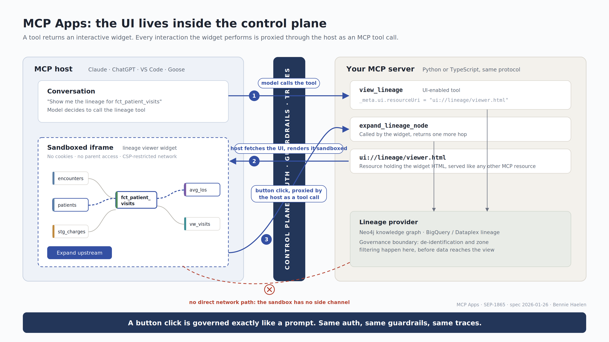
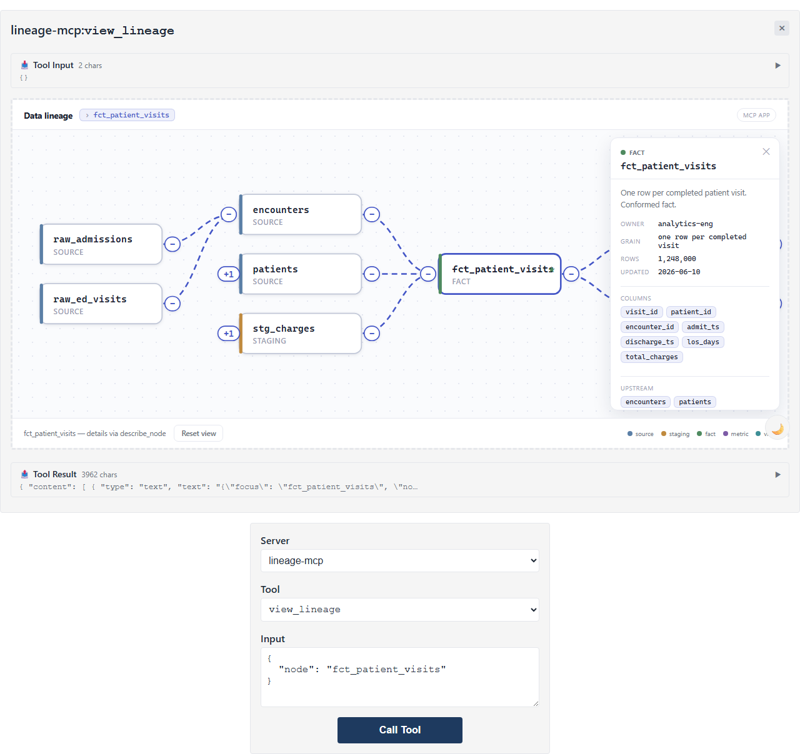
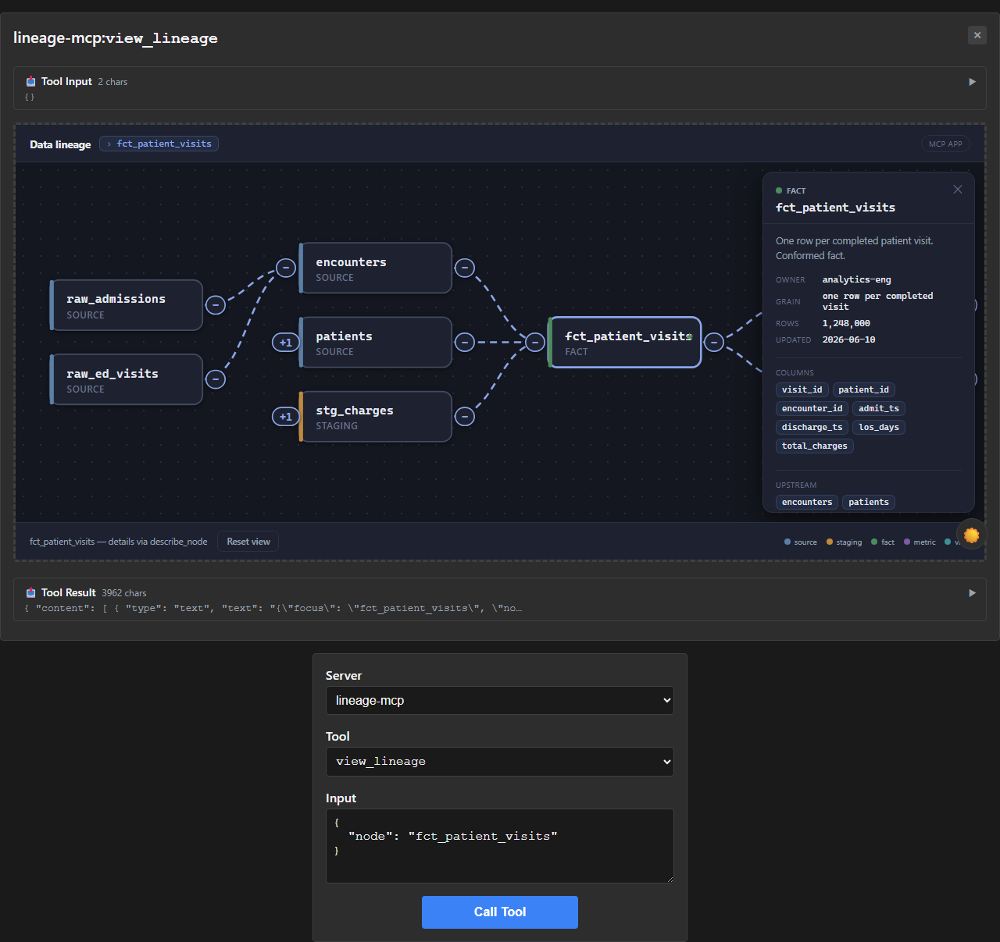

# MCP App controls for the data control plane

A runnable reference implementation of **MCP Apps** (SEP-1865): a tool returns an
*interactive widget*, the host renders it inside a sandboxed iframe, and **every
interaction the widget performs is proxied back through the host as an MCP tool
call** — governed by the same auth, guardrails, and traces as a prompt.

One MCP server (`mcp-ui-components`) serves **three** interactive controls, each a real
MCP App built with the official
[`@modelcontextprotocol/ext-apps`](https://github.com/modelcontextprotocol/ext-apps)
SDK, so they render as live interactive controls in hosts that support MCP Apps —
**VS Code Copilot Chat**, Claude Desktop, Goose, and others:

| Control | Tool | What it shows |
| --- | --- | --- |
| **Lineage viewer** | `view_lineage` | A data-lineage graph you expand and inspect node by node. |
| **SQL join diagram** | `view_join_diagram` | The joins in a SQL query as draggable table cards (join keys, columns, filters) wired by join-key connectors, alongside the natural-language prompt and the source SQL. |
| **Query plan** | `view_query_plan` | A whole SQL statement as an EXPLAIN-style logical execution pipeline: one operator box per clause (scan, join, filter, group-by, having, window, project, distinct, sort, limit) in execution order, with CTEs/subqueries as lanes that feed downstream operators. |



The screenshots below show the **lineage viewer** as an interactive control
inside an MCP Apps host — `encounters` expanded upstream via a proxied
`expand_lineage_node`, and the `avg_los` details panel populated by a proxied
`describe_node`:



Both controls follow the host's theme (and the OS `prefers-color-scheme` in the
offline demo), so they render in dark mode too:



---

## What's in the box

| Element | In this repo |
| --- | --- |
| **Lineage viewer** | |
| `view_lineage` / `expand_lineage_node` / `describe_node` (tool schemas + dispatch) | [`src/mcp_ui_components/components/lineage/__init__.py`](src/mcp_ui_components/components/lineage/__init__.py) |
| `ui://mcp-ui-components/viewer.html` (widget resource, `text/html;profile=mcp-app`) | [`src/mcp_ui_components/widgets/viewer.html`](src/mcp_ui_components/widgets/viewer.html) (built from [`widget/`](widget/)) |
| Lineage provider (Neo4j / BigQuery stand-in) | [`components/lineage/provider.py`](src/mcp_ui_components/components/lineage/provider.py) + [`data.py`](src/mcp_ui_components/components/lineage/data.py) |
| **SQL join diagram** | |
| `view_join_diagram` / `parse_join_sql` / `export_join_diagram` (tool schemas + dispatch) | [`src/mcp_ui_components/components/join_diagram/__init__.py`](src/mcp_ui_components/components/join_diagram/__init__.py) |
| `ui://mcp-ui-components/join-diagram.html` (widget resource, `text/html;profile=mcp-app`) | [`src/mcp_ui_components/widgets/join-diagram.html`](src/mcp_ui_components/widgets/join-diagram.html) (built from [`widget/`](widget/)) |
| SQL → join-model parser (`sqlglot`, multi-dialect) | [`components/join_diagram/sql.py`](src/mcp_ui_components/components/join_diagram/sql.py) + `JoinDiagramProvider` in [`provider.py`](src/mcp_ui_components/components/join_diagram/provider.py) |
| **Query plan** | |
| `view_query_plan` / `parse_query_plan` / `export_query_plan` (tool schemas + dispatch) | [`src/mcp_ui_components/components/query_plan/__init__.py`](src/mcp_ui_components/components/query_plan/__init__.py) |
| `ui://mcp-ui-components/query-plan.html` (widget resource, `text/html;profile=mcp-app`) | [`src/mcp_ui_components/widgets/query-plan.html`](src/mcp_ui_components/widgets/query-plan.html) (built from [`widget/`](widget/)) |
| SQL → query-plan parser (`sqlglot`, reuses the join helpers) | [`components/query_plan/sql.py`](src/mcp_ui_components/components/query_plan/sql.py) + `QueryPlanProvider` in [`provider.py`](src/mcp_ui_components/components/query_plan/provider.py) |
| **Shared** | |
| Tool/resource registry (aggregates the components) | [`src/mcp_ui_components/registry.py`](src/mcp_ui_components/registry.py) |
| Shared SQL helpers · seed example · HTML export | [`shared/sql.py`](src/mcp_ui_components/shared/sql.py) · [`examples.py`](src/mcp_ui_components/shared/examples.py) · [`export.py`](src/mcp_ui_components/shared/export.py) |
| Real MCP server (stdio **and** streamable HTTP) | [`src/mcp_ui_components/server.py`](src/mcp_ui_components/server.py) |
| Offline host to preview any widget | [`demo/host.py`](demo/host.py) |

Each widget's HTML under `src/mcp_ui_components/widgets/` is the **committed build
output** of a TypeScript app in `widget/`. You only need Node if you want to
change a widget (see [Building the widgets](#building-the-widgets)).

---

## Use it in VS Code (the real thing)

VS Code Copilot Chat has full MCP Apps support, so all three widgets render as
interactive controls in chat.

1. Install the server's dependencies (`mcp` + `sqlglot`):

   ```bash
   pip install -e .          # installs both; `pip install mcp` alone omits sqlglot (the SQL controls need it)
   ```

2. Add the server to VS Code's `mcp.json`
   (`Ctrl+Shift+P → MCP: Open User Configuration`). The server speaks two
   transports — pick one.

   **Option A — stdio (recommended).** VS Code launches the process itself, so
   there are no ports to manage and no chance of connecting to a different
   server on the same port:

   ```jsonc
   {
     "servers": {
       "lineage": {
         "command": "python",
         "args": ["-m", "mcp_ui_components.server"],
         "env": { "PYTHONPATH": "C:\\src\\mcp-ui-components\\src" }
       }
     }
   }
   ```

   > Tip: if VS Code's `python` isn't the interpreter that has `mcp` installed,
   > use that interpreter's **full path** as `command` (e.g.
   > `C:\\Users\\you\\AppData\\Local\\Python\\...\\python.exe`). After
   > `pip install -e .` you can instead use `"command": "mcp-ui-components"` and drop
   > `PYTHONPATH`.

   **Option B — streamable HTTP.** VS Code connects to a server you run
   yourself. Start it first in a terminal:

   ```bash
   # PowerShell
   $env:PYTHONPATH = "C:\src\mcp-ui-components\src"
   python -m mcp_ui_components.server --http --port 3001   # serves http://127.0.0.1:3001/mcp
   ```

   then point `mcp.json` at it:

   ```jsonc
   {
     "servers": {
       "lineage": { "type": "http", "url": "http://localhost:3001/mcp" }
     }
   }
   ```

   > With HTTP, VS Code connects to **whatever owns that port** — make sure no
   > other server is already on 3001, or you'll get its results instead.

3. Start the server in VS Code (`MCP: List Servers → lineage → Start`), then open
   Copilot Chat in **Agent** mode. Either ask in plain language, or reference the
   tool directly with `#` to force the call and render it inline — e.g. type
   `#view_lineage`, `#view_join_diagram`, or `#view_query_plan`.

   **Lineage viewer** — ask:

   > Show me the lineage for fct_patient_visits

   The model calls `view_lineage`; VS Code renders the interactive graph inline.
   Then interact with it directly — **every interaction is proxied back through
   the host as a governed MCP tool call**:

   | Interaction | Proxied call |
   | --- | --- |
   | **Click a node** | `describe_node` → details panel (owner, grain, rows, columns, neighbours) |
   | **＋ on a node** (left = upstream, right = downstream) | `expand_lineage_node` → reveals that node's neighbours |
   | **− on a node** | collapse that branch (local) |
   | **Double-click a node** | `view_lineage` → recenter the graph on it |
   | **Reset view** | restore the initial graph (local) |

   **SQL join diagram** — paste a query (or ask with no SQL for a bundled
   example):

   > Diagram the joins in this query: `SELECT … FROM … JOIN …`

   The model calls `view_join_diagram`; VS Code renders one card per table wired
   by join-key connectors. Interactions:

   | Interaction | What happens |
   | --- | --- |
   | **Drag a card** | reposition it — including to the left of / above the spine (local) |
   | **Hover / click a join key** | highlight that key across every card and its connectors (local) |
   | **Click a card or legend badge** | focus that join, dim the rest (local) |
   | **Columns / Derived / Filters** toggles | show/hide those sections (local) |
   | **Zoom / Fit / Reset view** | zoom controls; Fit frames the diagram; Reset view restores the auto-layout (local) |
   | **Edit SQL → Apply** | `parse_join_sql` → re-parses your edited SQL and re-renders the diagram |
   | **Copy SQL** | copy the query (local) |

   To save a diagram, see [Exporting](#exporting) below.

   **Query plan** — paste a query (or ask with no SQL for the bundled example):

   > Show the execution plan for this query: `WITH … SELECT … GROUP BY …`

   The model calls `view_query_plan`; VS Code renders the statement as a pipeline
   of operator boxes in logical execution order, one lane per CTE/subquery.
   Interactions:

   | Interaction | What happens |
   | --- | --- |
   | **Hover / click an operator** | highlight its tables + columns in the SQL, dim the rest (local) |
   | **Click a lane in the legend** | focus that lane (CTE / subquery / main) (local) |
   | **Click a lane header** | collapse / expand the lane (local) |
   | **Drag an operator** | reposition it (local) |
   | **Detail / Collapse lanes** | hide operator detail lines / collapse every lane (local) |
   | **Zoom / Fit / Reset view** | zoom controls; Fit frames the plan; Reset view restores the auto-layout (local) |
   | **Edit SQL → Apply** | `parse_query_plan` → re-parses your edited SQL and re-renders the pipeline |
   | **Copy SQL** | copy the query (local) |

   To save a plan, see [Exporting](#exporting) below.

### Exporting

The widget renders inside a **sandboxed iframe**, which blocks file downloads —
so export lives *outside* the widget, as governed MCP tools you call from chat:

| Tool | What it does |
| --- | --- |
| `export_join_diagram` | Writes a self-contained, **interactive** HTML copy of the join diagram to disk and returns the path. |
| `export_query_plan` | Same, for the query plan. |

Invoke one with `#export_query_plan` (or just ask: *"export this as HTML"*).
It reuses the vendored widget bundle with your parsed model injected as
`window.__MCP_MODEL__`, so opening the file in any browser renders the full
interactive diagram with **no host needed** — and there (a normal browser tab,
not a sandbox) its **Export PNG / Export SVG** buttons and **Print** all work.

Files are written to the **workspace folder** (the server's cwd) by default; set
`MCP_UI_COMPONENTS_EXPORT_DIR` in `mcp.json` to pin a different folder:

```jsonc
"mcp-ui-components": {
  "command": "python",
  "args": ["-m", "mcp_ui_components.server"],
  "env": {
    "PYTHONPATH": "C:\\src\\mcp-ui-components\\src",
    "MCP_UI_COMPONENTS_EXPORT_DIR": "C:\\Users\\you\\Desktop"
  }
}
```

---

## Preview it offline (no Node, no VS Code)

`demo/host.py` launches the MCP server **and** a vendored copy of the official
MCP Apps reference host, wired together. It speaks the same protocol VS Code
uses, so it's a faithful preview — and it exposes **all three** controls.

```bash
pip install -e .          # the SQL controls need sqlglot (a declared dependency)
python demo/host.py
# lineage viewer:   http://localhost:8080/?tool=view_lineage&call=true
# SQL join diagram: http://localhost:8080/?tool=view_join_diagram&call=true
# query plan:       http://localhost:8080/?tool=view_query_plan&call=true
```

It serves:
- the MCP server on `:8770`,
- the host UI on `:8080`,
- the sandbox proxy on `:8081` (a second origin, with CSP headers).

Pick a tool, click **Call Tool**, then interact with the widget. (The reference
host bundles under `demo/_vendor_host/` are MIT-licensed builds of
`modelcontextprotocol/ext-apps` `basic-host` — see the README there.)

---

## How the widget talks to the host

The widget is sandboxed and has no network of its own. Its only channel is the
MCP Apps SDK, which runs MCP JSON-RPC over `window.postMessage`:

```ts
import { App } from "@modelcontextprotocol/ext-apps";

const app = new App({ name: "Lineage Viewer", version: "0.1.0" });

// The host delivers the originating view_lineage result here:
app.ontoolresult = (result) => render(result.structuredContent);

// "Expand upstream" — proxied through the host as a tool call:
const res = await app.callServerTool({
  name: "expand_lineage_node",
  arguments: { node, visible_node_ids, direction: "upstream" },
});

app.connect();
```

On the server side, the tool declares its UI and the resource uses the MCP Apps
MIME type:

```python
# components/lineage/__init__.py (shape)
TOOLS = [{
  "name": "view_lineage",
  "_meta": {"ui": {"resourceUri": "ui://mcp-ui-components/viewer.html"}},
  ...
}]
RESOURCE_MIME_TYPE = "text/html;profile=mcp-app"
```

The **join diagram** follows the identical pattern: `view_join_diagram` declares
`ui://mcp-ui-components/join-diagram.html`, and the widget's **Edit SQL → Apply** action
proxies through `app.callServerTool({ name: "parse_join_sql", … })` — the same
governed round-trip, so re-parsing edited SQL is auditable exactly like a prompt.

For a full walkthrough of how a widget interaction reaches your Python logic and
database — with a sequence diagram and the actual code at each hop — see
**[docs/python-from-typescript.md](docs/python-from-typescript.md)**.

---

## Data model

The in-memory graph (`data.py`) is the one drawn in the diagram, plus a second
upstream hop hidden until **Expand upstream** asks for it:

```
raw_admissions ┐
raw_ed_visits  ┴─▶ encounters ┐
raw_patients    ─▶ patients   ┼─▶ fct_patient_visits ─▶ avg_los
raw_charges     ─▶ stg_charges┘        (focus)        └─▶ vw_visits
                ^^^^^^^^^^^^^^^
                hidden until expand
```

In production the provider would talk to Neo4j or BigQuery/Dataplex behind the
governance boundary (de-identification, zone filtering). The interface
(`view` / `expand`) is what an adapter would implement.

---

## Building the widgets

Only needed if you change a widget's UI. Each build bundles the SDK + one app
into a single self-contained HTML. The `INPUT` env var (wired through the npm
scripts) selects which app to build.

```bash
cd widget
npm install

# Lineage viewer:
npm run build
cp dist/index.html ../src/mcp_ui_components/widgets/viewer.html

# SQL join diagram:
npm run build:join
cp dist/join-diagram.html ../src/mcp_ui_components/widgets/join-diagram.html

# Query plan:
npm run build:plan
cp dist/query-plan.html ../src/mcp_ui_components/widgets/query-plan.html
```

| App | Shell | Source | Served as |
| --- | --- | --- | --- |
| Lineage viewer | `widget/index.html` | `widget/src/lineage-app.ts` | `widgets/viewer.html` |
| SQL join diagram | `widget/join-diagram.html` | `widget/src/join-diagram-app.ts` | `widgets/join-diagram.html` |
| Query plan | `widget/query-plan.html` | `widget/src/query-plan-app.ts` | `widgets/query-plan.html` |

> The server re-reads the `join-diagram.html` and `query-plan.html` resources
> from disk on **every** tool call (their cache is disabled), so after a
> `build:join` / `build:plan` + copy you can just re-invoke the tool — no server
> restart needed. The lineage viewer's HTML *is* cached, so it needs a server
> restart to pick up a rebuild.

---

## Project layout

```
src/mcp_ui_components/
  __init__.py               version + WIDGET_URI / JOIN_WIDGET_URI / QUERY_PLAN_URI + MIME type
  registry.py               aggregates the components into the server's tool/resource surface
  server.py                 real MCP server — stdio and streamable HTTP
  shared/
    sql.py                  sqlglot AST helpers + colour palette (shared by both parsers)
    examples.py             bundled SQL example (shared by the two SQL controls)
    export.py               self-contained interactive-HTML export (the export_* tools)
  components/
    lineage/                __init__.py (tools+dispatch) · provider.py · data.py
    join_diagram/           __init__.py · provider.py · sql.py (SQL → join-model parser)
    query_plan/             __init__.py · provider.py · sql.py (SQL → query-plan parser)
  widgets/viewer.html       built lineage-viewer widget (committed build output)
  widgets/join-diagram.html built join-diagram widget   (committed build output)
  widgets/query-plan.html   built query-plan widget     (committed build output)
widget/                     TypeScript source for all widgets (Vite single-file builds)
  index.html / src/lineage-app.ts              lineage viewer
  join-diagram.html / src/join-diagram-app.ts  SQL join diagram
  query-plan.html / src/query-plan-app.ts      query plan
demo/
  host.py                   offline launcher: MCP server + vendored reference host
  _vendor_host/             MIT-licensed prebuilt MCP Apps reference host
tests/
  test_provider.py          provider + dispatch + resource tests
  test_join_model.py        SQL → join-model parser tests
  test_query_plan.py        SQL → query-plan parser tests
docs/                       the source diagram + live screenshots
```

## Tests

```bash
pip install pytest
python -m pytest tests/ -q
```

`test_provider.py` covers the lineage provider, dispatch, and widget resource;
`test_join_model.py` and `test_query_plan.py` cover the SQL → join-model and
SQL → query-plan parsers (and their tool dispatch). The lineage control is
additionally verified end-to-end by driving the official MCP Apps reference host
against this server with Playwright: it connects, calls `view_lineage`, renders
the widget, and the proxied `expand_lineage_node` grows the graph to 10 nodes.

---

MCP Apps · SEP-1865 · spec 2026-01-26 · Bennie Haelen · MIT
