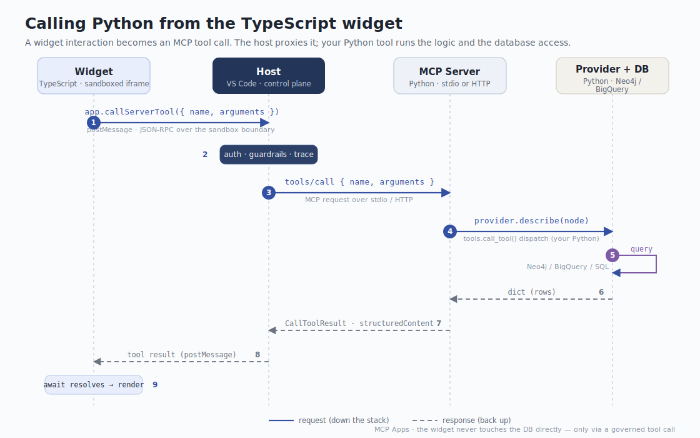

# Calling Python from the TypeScript widget

**Short version:** the widget never calls Python directly. It calls an **MCP
tool**, and your **MCP tools *are* your Python functions**. The host sits in the
middle and proxies the call — so the widget physically cannot reach your logic or
database except through a governed tool call.



The widget is a sandboxed iframe: no cookies, no parent access, no network of its
own. Its only channel out is `window.postMessage`, which the MCP Apps SDK uses to
speak JSON-RPC to the host. The host is the one holding the MCP connection to your
Python server.

---

## The path, step by step

Take the "click a node → show details" interaction. It crosses four boundaries
and comes back, all from one `await`.

### 1 · TypeScript asks for data (`widget/src/lineage-app.ts`)

```ts
// The widget doesn't query anything itself — it asks the host to run a tool.
const res = await app.callServerTool({
  name: "describe_node",
  arguments: { node: id },
});
renderDetails(res.structuredContent);   // <- the Python dict, as JSON
```

`app` is the SDK's `App` instance. `callServerTool` serialises the request and
`postMessage`s it to the host. That's the only thing the iframe does.

### 2 · The host governs the call

The host (VS Code, Claude Desktop, …) receives the postMessage and treats it
exactly like any other tool call the model might make: it authenticates, applies
guardrails, and records a trace. This is the "the UI lives inside the control
plane" guarantee — a button click is governed like a prompt.

### 3 · The host forwards it over MCP

The host turns it into a standard MCP `tools/call` request and sends it to your
server over whichever transport is configured (stdio or streamable HTTP). Same
request shape either way.

### 4 · Your Python server dispatches it

The server's `call_tool` handler (`src/lineage_mcp/server.py`) hands off to the
transport-agnostic dispatch in `src/lineage_mcp/tools.py`:

```python
# tools.py
def call_tool(name: str, arguments: dict | None) -> dict:
    args = arguments or {}
    ...
    if name == "describe_node":
        node = args.get("node")
        if not node:
            raise ValueError("describe_node requires 'node'")
        return {"structuredContent": _provider.describe(node)}
```

### 5 · Your provider runs the logic + DB access

`src/lineage_mcp/provider.py` is where the real work lives. Today it reads an
in-memory graph; swap the body for a Neo4j/BigQuery/SQL query and nothing else
has to change:

```python
# provider.py  (this is the function that would talk to your database)
def describe(self, node: str) -> dict:
    n = self._g.nodes[node]                 # <- replace with a real query
    details = NODE_DETAILS.get(node, {})
    return {
        "id": n.id, "label": n.label, "kind": n.kind,
        "description": n.description,
        "upstream":   [self._g.nodes[p].label for p in self._g.parents(node)],
        "downstream": [self._g.nodes[c].label for c in self._g.children(node)],
        **details,                          # owner, rows, columns, …
    }
```

### 6–9 · The result flows back

The Python `dict` becomes the tool result's `structuredContent`, travels back
over MCP to the host, the host `postMessage`s it to the widget, the `await`
resolves, and the widget renders. One round trip, fully governed.

---

## Add your own Python-backed tool

Three small edits — all the real work stays in Python.

1. **Write the function** (`provider.py`) — put DB access here:

   ```python
   def impact_analysis(self, node: str) -> dict:
       rows = self._db.run(
           "MATCH (n {id:$id})-[:FEEDS*]->(d) RETURN d", id=node
       )
       return {"affected": [r["d"] for r in rows]}
   ```

2. **Register it as a tool** (`tools.py`) — add a schema to `TOOLS` and a branch
   in `call_tool`:

   ```python
   # in TOOLS
   {
     "name": "impact_analysis",
     "description": "List models affected if this node changes.",
     "inputSchema": {
       "type": "object",
       "properties": {"node": {"type": "string"}},
       "required": ["node"],
     },
   }

   # in call_tool()
   if name == "impact_analysis":
       return {"structuredContent": _provider.impact_analysis(args["node"])}
   ```

3. **Call it from TypeScript** (`lineage-app.ts`):

   ```ts
   const res = await app.callServerTool({
     name: "impact_analysis",
     arguments: { node: id },
   });
   const affected = res.structuredContent.affected;
   ```

That's it — the new capability is immediately governed by the host's auth,
guardrails, and traces.

---

## Things to keep in mind

- **JSON in, JSON out.** Tool arguments and results must be JSON-serialisable
  (dicts, lists, strings, numbers, bools). You can't pass live Python objects
  across the boundary.
- **Async is fine.** The MCP server tool handler can be `async` for DB I/O, and
  `callServerTool` returns a Promise — that's why the widget `await`s it.
- **The server process is long-lived,** so it's the right place to hold DB
  connection pools, clients, and credentials. Put them on the provider.
- **The indirection is the point.** Because every call goes through the host, the
  widget can't reach your database except through a governed tool call — so your
  data access inherits the host's auth, guardrails, and traces for free.

See also: [`mcp-apps-control-plane.svg`](mcp-apps-control-plane.svg) for the
overall architecture.
